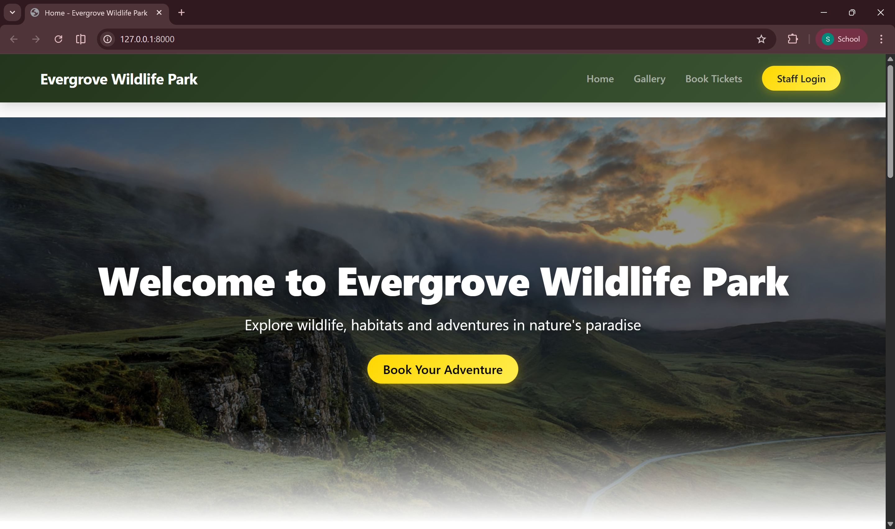
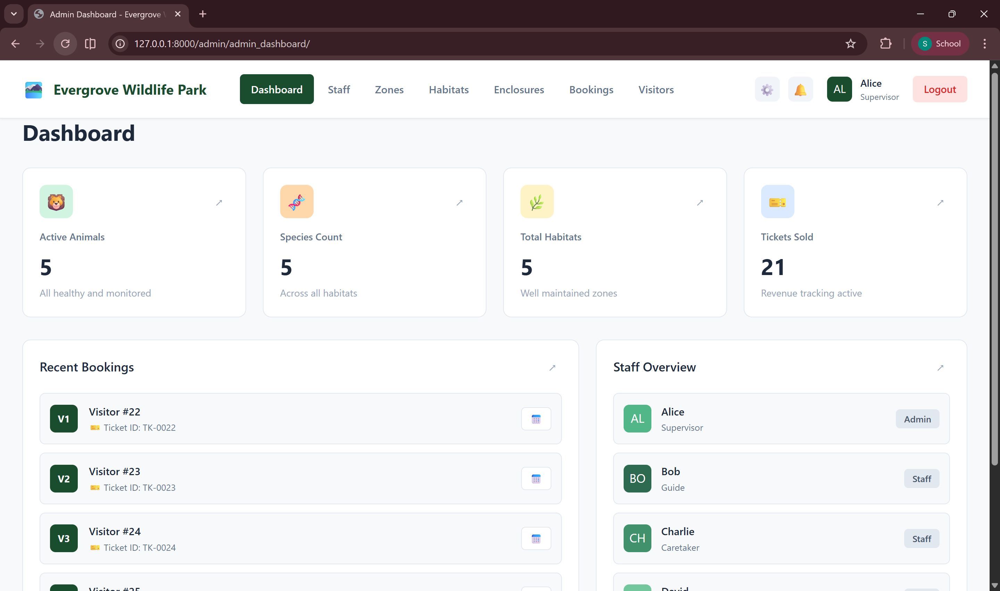
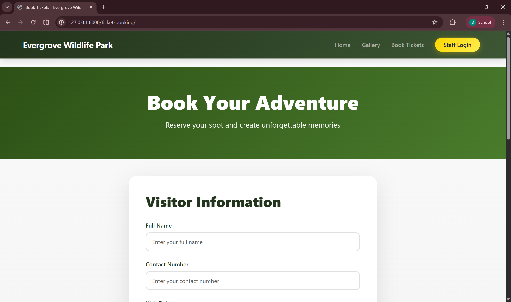

# National Park Management System

## Overview
This project is a database-driven system designed to manage wildlife conservation and national park operations. It integrates a normalized MySQL database with a Django-based web application to support both visitor services and administrative workflows.

## Project Components
- Detailed ER modeling and normalization (up to 3NF)
- MySQL database with constraints, procedures, triggers, and analytical queries
- Django web application with full CRUD operations

## ER Modeling
A comprehensive ER diagram with approximately 30–35 entities was designed to model the national park ecosystem. A subset of core entities was implemented in the database to demonstrate system feasibility and real-world functionality.

## Database Implementation
- Database: MySQL
- Includes stored procedures and triggers
- Implements real-world business rules and constraints
- Supports analytical and administrative queries

## Web Application
Developed using Django, HTML, CSS, and JavaScript.

### Features
- Visitor ticket booking with validations
- Booking confirmation workflow
- Staff login and admin dashboard
- CRUD operations for staff, zones, habitats, enclosures, visitors, and tickets

## Technologies Used
- MySQL
- Django
- Python
- HTML, CSS, JavaScript
## Application Screenshots

### Visitor Interface
- Homepage
- Wildlife Gallery
- Ticket Booking and Confirmation

### Administrative Interface
- Staff Login
- Admin Dashboard
- CRUD Operations for Staff
- Management of Zones, Habitats, Enclosures, Visitors, and Tickets

### Homepage

### Admin Dashboard

### Ticket Booking

## Future Enhancements
- Role-based access control
- Online payment integration
- Real-time analytics and reporting
- Expansion of remaining ER entities
